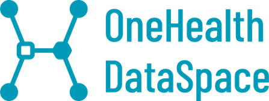

# OneHealth DataSpace
Bienvenido al repositorio de notebooks de Python compartidos del Programa de OneHealth DataSpace!


Este espacio está diseñado para que los usuarios colaboren y compartan sus proyectos y análisis de datos realizados con notebooks Jupyter, el repositorio contiene [notebooks de ejemplo, tutoriales y casos de uso que serán de ayuda al comenzar a utilizar la plataforma](/onehealth-es).  

## Propósito
El objetivo de este repositorio es fomentar la colaboración, el aprendizaje y el intercambio de conocimientos relacionados con la ciencia marina y el análisis de datos mediante notebooks de Jupyter.

## Uso de notebooks de Python
Para empezar a usar los notebooks de Python, la forma más sencilla es utilizar el portal de acceso:
- [Portal de OneHealth DataSpace - Big Data](https://bigdata.dataspace.cesga.es/)

## Compartir notebooks de Python con el resto de la comunidad.
Si creas un Notebook y quieres compartirlo con el resto de la comunidad, haznos un ```merge request```.

## Cómo realizar merge request
Si deseas contribuir a este repositorio, sigue estos pasos para realizar un **Merge Request** de forma ordenada:

1. **Fork (bifurca) el repositorio:** Bifurca este repositorio en tu cuenta de GitLab haciendo clic en el botón "Fork" que se encuentra en la parte superior derecha de esta página.
2. **Clonar el repositorio:** Clona tu bifurcación en tu máquina local, por ejemplo usando el comando ```git clone git@github.com:dataspacedatalife/dataspace-bigdata-notebooks.git```
3. **Crear una rama:** Crea una rama para trabajar con el comando git checkout -b rama.
4. **Realiza tus cambios:** Agrega o modifica tus Jupyter Notebooks.
5. **Realiza un Commit:** haz un commit de tus cambios con git commit -m "Mensaje descritivo del cambio realizado".
6. **Lanza Push:** Sube tus cambios a tu bifurcación en GitLab.com, por ejemplo con `git push origin rama`.
7. **Crea una solicitud de fusión:** Ve a la página de tu bifurcación en GitLab y pulsa el botón "Nueva solicitud de fusión". Asegúrate de proporcionar una descripción detallada de tu contribución.
8. **Revisión y aprobación:** Los colaboradores del proyecto revisarán su solicitud de fusión y podrán solicitar cambios o aprobarla directamente.
9. **Mantén tu rama actualizada:** Si hay cambios en la rama principal del repositorio original, asegúrate de mantener tu rama actualizada con git pull origin main.
10. **Limpia tu rama:** Una vez que se acepte tu solicitud de fusión, puedes eliminar la rama que creaste.

Esperamos que esta guía te ayude a contribuir eficazmente a este repositorio. Si tienes alguna pregunta o necesitas ayuda, no dudes en crear una incidencia o contactarnos.
Normas de uso correcto

## Para mantener un entorno colaborativo y respetuoso, les pedimos que sigan estas normas de uso:

1. **Respeto y cortesía:** no se tolerarán comentarios despectivos, ofensivos ni discriminatorios.
2. **Contenido apropiado:** Asegúrate de que el contenido de tus notebooks de Python sea apropiado y cumpla con los estándares básicos.
3. **Documentación:** Proporcione documentación clara y concisa en sus notebooks de Python. Explique su trabajo, el contexto y cómo otros pueden utilizarlo.

## Documentación adicional
La plataforma CESGA Big Data se basa en las tecnologías Hadoop y Spark; puede encontrar información detallada en:
- [Plataforma BigData CESGA](https://bigdata.cesga.gal)
- [Curso Spark](https://github.com/javicacheiro/pyspark_course)

---


# OneHealth DataSpace
Dámosvos a benvida ó repositorio de notebooks compartido de **OneHealth DataSpace**!


Este espazo está deseñado para que os usuarios poidan colaborar e compartir os seus proxectos e análises de datos realizados mediante notebooks de Jupyter, o repositorio contén [notebooks de exemplo, tutoriais e casos de uso que servirán de axuda á hora de comezar a utilizar a plataforma](/onehealth-gl).

## Propósito
O propósito deste repositorio é fomentar a colaboración, a aprendizaxe e o intercambio de coñecementos relacionados coa ciencia e análise de datos mariños a través de notebooks de Jupyter.

## Usando os Notebooks
Para comezar a utilizar os notebooks o máis doado é utilizar o portal de acceso:
- [Portal de OneHealth DataSpace - Big Data](https://bigdata.dataspace.cesga.es/)

## Compartindo Notebooks co resto da comunidade
Se creas un Notebook e queres compartilo co resto da comunidade fainos un ```merge request```.

## Como facer Merge Requests
Se desexas contribuír a este repositorio, segue estes pasos para facer un **Merge Request** de maneira ordenada:

1. **Fork do repositorio:** Fai un fork deste repositorio na túa conta de GitLab facendo clic no botón "Fork" na parte superior dereita desta páxina.
2. **Clona o repositorio:** Clona o teu fork á túa máquina local, por exemplo co comando `git@github.com:dataspacedatalife/dataspace-bigdata-notebooks.git`.
3. **Crea unha rama:** Crea unha rama na que traballar co comando `git checkout -b rama`.
4. **Realiza os teus cambios:** Agrega ou modifica os teus Notebooks de Jupyter.
5. **Fai Commit:** Fai commit dos teus cambios con `git commit -m "Mensaxe descritiva"`.
6. **Fai Push:** Sobe os teus cambios ao teu fork en GitLab con `git push origin rama`.
7. **Crea un Merge Request:** Ve á páxina do teu fork en GitLab e presiona o botón "New Merge Request". Asegúrache de proporcionar unha descrición detallada da túa contribución.
8. **Revisión e aprobación:** Os colaboradores do proxecto revisarán o teu Merge Request e poden solicitar cambios ou aprobalo directamente.
9. **Mantén a túa rama actualizada:** Se hai cambios na rama principal do repositorio orixinal, asegúrache de manter a túa rama actualizada con `git pull origin main`.
10. **Limpa a túa rama:** Unha vez que a túa Merge Request sexa aceptado, podes eliminar a rama que creaches.

Esperamos que esta guía axúdeche a contribuír de maneira efectiva a este repositorio.
Se tes algunha pregunta ou necesitas axuda, non dubides en crear un issue ou contactarnos.

## Normas de uso correcto
Para manter unha contorna colaborativa e respectuosa, pedímosche que sigas estas normas de uso:
1. **Respecto e cortesía:** Comentarios despectivos, ofensivos ou discriminatorios non serán tolerados.
2. **Contido apropiado:** Asegúrache de que o contido dos teus notebooks sexa apropiado e cumpra coas normas básicas.
3. **Documentación:** Proporciona unha documentación clara e concisa nos teus notebooks. Explica o teu traballo, o contexto e como outros poden utilizalo.

## Documentación adicional
A plataforma BigData do CESGA está baseada nas tecnoloxías Hadoop e Spark, podes encontrar información detallada en:
- [Plataforma BigData CESGA](https://bigdata.cesga.gal)
- [Curso Spark](https://github.com/javicacheiro/pyspark_course)

---


# OneHealth DataSpace
Welcome to the **OneHealth DataSpace** shared notebook repository!

This space is designed for users to collaborate and share their projects and data analyses carried out using Jupyter notebooks, the repository contains [example notebooks, tutorials and use cases that will help you get started using the platform](/onehealth-es).

## Purpose
The objective of this repository is to foster collaboration, learning, and knowledge sharing related to marine science and data analysis using Jupyter notebooks.

## Using Python Notebooks
To begin using Python notebooks, the easiest way is to use the access portal:
- [OneHealth DataSpace - Big Data Portal](https://bigdata.dataspace.cesga.es/)
